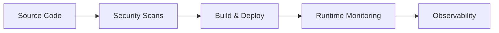
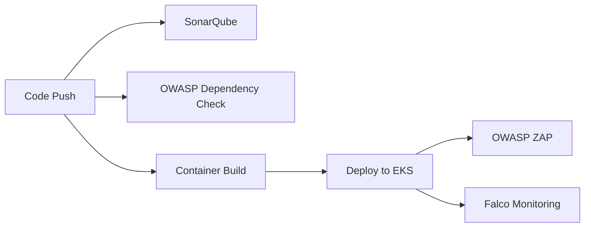

# DevSecOps Pipeline Showcase

[](https://kubernetes.io/)
[](https://aws.amazon.com/)
[](https://istio.io/)
[](https://spring.io/projects/spring-boot)
[](https://prometheus.io/)
[](https://grafana.com/)
[](https://owasp.org/www-project-zap/)
[](https://falco.org/)
[](https://www.sonarqube.org/)
[](https://www.openpolicyagent.org/)

> **Enterprise-Grade DevSecOps Pipeline on Amazon EKS with Complete Security, Observability, and Automation**

A comprehensive DevSecOps demonstration showcasing automated security testing, complete observability stack, service mesh security, and runtime protection in a production-ready Kubernetes environment.

## 🏗️ Architecture Overview

### Technology Stack
- **Container Orchestration**: Amazon EKS (Elastic Kubernetes Service)
- **Service Mesh**: Istio for traffic management, security, and observability
- **Application**: Spring Boot microservice with REST API endpoints
- **Security Testing**: OWASP ZAP for DAST, OWASP Dependency Check for SAST, SonarQube for code quality
- **Runtime Security**: Falco for real-time threat detection
- **Policy Enforcement**: Open Policy Agent (OPA) for Kubernetes security policies
- **Monitoring**: Prometheus, Grafana, Jaeger, and Kiali
- **Infrastructure as Code**: Helm charts for deployment automation

### DevSecOps Pipeline Flow



## ✨ Key Features

### 🔒 Security-First Approach
- **Automated SAST/DAST Integration**: OWASP Dependency Check, SonarQube, and ZAP scanning integrated into CI/CD pipeline
- **Container Security**: Multi-layer container scanning with vulnerability assessment
- **Kubernetes Security**: Kubesec scanning for manifest security validation
- **Policy as Code**: OPA policies enforcing security best practices
- **Runtime Protection**: Falco monitoring for real-time threat detection

### 📊 Complete Observability Stack
- **Metrics Collection**: Prometheus gathering application and infrastructure metrics
- **Visualization**: Grafana dashboards for comprehensive monitoring
- **Distributed Tracing**: Jaeger for request tracing across microservices
- **Service Mesh Observability**: Kiali for Istio service mesh visualization

### 🔧 Service Mesh Security
- **mTLS Encryption**: Automatic service-to-service encryption
- **Traffic Management**: Intelligent routing and load balancing
- **Security Policies**: Fine-grained access control and authorization
- **Circuit Breaking**: Automatic failure detection and recovery

## 🏛️ Architecture Diagrams

### EKS Cluster Architecture

```
┌─────────────────────────────────────────────────────────────────┐
│                        Amazon EKS Cluster                       │
├─────────────────────────────────────────────────────────────────┤
│  ┌─────────────────┐  ┌─────────────────┐  ┌─────────────────┐  │
│  │   Worker Node 1  │  │   Worker Node 2  │  │   Worker Node 3  │  │
│  │                 │  │                 │  │                 │  │
│  │ ┌─────────────┐ │  │ ┌─────────────┐ │  │ ┌─────────────┐ │  │
│  │ │   Istio     │ │  │ │   Istio     │ │  │ │   Istio     │ │  │
│  │ │   Proxy     │ │  │ │   Proxy     │ │  │ │   Proxy     │ │  │
│  │ └─────────────┘ │  │ └─────────────┘ │  │ └─────────────┘ │  │
│  │                 │  │                 │  │                 │  │
│  │ ┌─────────────┐ │  │ ┌─────────────┐ │  │ ┌─────────────┐ │  │
│  │ │ Spring Boot │ │  │ │   Falco     │ │  │ │   Falco     │ │  │
│  │ │ Application │ │  │ │   Agent     │ │  │ │   Agent     │ │  │
│  │ └─────────────┘ │  │ └─────────────┘ │  │ └─────────────┘ │  │
│  └─────────────────┘  └─────────────────┘  └─────────────────┘  │
├─────────────────────────────────────────────────────────────────┤
│  ┌─────────────────┐  ┌─────────────────┐  ┌─────────────────┐  │
│  │   Prometheus    │  │     Grafana     │  │     Jaeger      │  │
│  │   (Metrics)     │  │  (Dashboards)   │  │   (Tracing)     │  │
│  └─────────────────┘  └─────────────────┘  └─────────────────┘  │
│  ┌─────────────────┐  ┌─────────────────┐  ┌─────────────────┐  │
│  │     Kiali       │  │   OWASP ZAP     │  │   OPA Server    │  │
│  │ (Mesh Viz)      │  │   (DAST)        │  │ (Policy Engine) │  │
│  └─────────────────┘  └─────────────────┘  └─────────────────┘  │
│  ┌─────────────────┐  ┌─────────────────┐  ┌─────────────────┐  │
│  │   SonarQube     │  │   OWASP Dep     │  │     Falco       │  │
│  │ (Code Quality)  │  │   Check (SAST)  │  │ (Runtime Sec)   │  │
│  └─────────────────┘  └─────────────────┘  └─────────────────┘  │
└─────────────────────────────────────────────────────────────────┘
```

### Security Scanning Workflow



## 🔒 Security Features

### Automated Vulnerability Scanning
- **SAST**: OWASP Dependency Check and SonarQube for code quality and security analysis
- **Container Security**: Multi-layer container scanning with vulnerability assessment
- **Kubernetes Security**: Kubesec scanning for manifest security validation
- **Runtime Security**: Falco monitoring for real-time threat detection
- **DAST**: OWASP ZAP for dynamic application security testing

### Security Automation
- Automated vulnerability scanning integrated into CI/CD pipeline
- Policy enforcement with OPA for Kubernetes security
- Real-time threat detection and alerting
- Automated issue creation for security findings

## 📊 Monitoring & Observability

### Complete Observability Stack
- **Prometheus**: Metrics collection and storage
- **Grafana**: Visualization and dashboards
- **Jaeger**: Distributed tracing
- **Kiali**: Service mesh visualization

### Monitoring Capabilities
- Application performance metrics
- Security event monitoring
- Infrastructure health monitoring
- Service mesh traffic visualization

## 🚀 Roadmap and Upcoming Enhancements

### Implementation Timeline

| Phase | Status | Timeline | Key Features |
|-------|--------|----------|--------------|
| **Phase 1: GitOps Implementation** | 📋 Planned | Q1 2024 | ArgoCD, Multi-environment, Progressive Delivery |
| **Phase 2: Advanced Secrets Management** | 📋 Planned | Q2 2024 | HashiCorp Vault, Dynamic Secrets, PKI Management |
| **Phase 3: Enhanced Security Tooling** | 📋 Planned | Q3 2024 | Trivy, OPA Gatekeeper, Supply Chain Security |
| **Phase 4: Compliance & Governance** | 🔮 Future | Q4 2024 | Automated Compliance, Multi-cluster Governance |

### Technology Stack Evolution

#### Current Stack
```
✅ Kubernetes (EKS)
✅ Istio Service Mesh
✅ Prometheus + Grafana
✅ OWASP ZAP + Dependency Check
✅ SonarQube Code Quality
✅ Falco Runtime Security
✅ OPA Basic Policies
```

#### Planned Additions
```
📋 ArgoCD (GitOps)
📋 HashiCorp Vault
📋 Trivy (Container Scanning)
📋 OPA Gatekeeper
🔮 Advanced Compliance
🔮 Multi-Cluster Federation
```

## 📊 Capability Comparison

### Current vs Planned Capabilities

| Capability | Current | Planned | Timeline |
|------------|---------|---------|----------|
| **Deployment Strategy** | Manual Helm deployments | GitOps with ArgoCD | Q1 2024 |
| **Secrets Management** | Static Kubernetes secrets | HashiCorp Vault | Q2 2024 |
| **Security Scanning** | OWASP + SonarQube | Trivy + Advanced scanning | Q3 2024 |
| **Policy Enforcement** | Basic OPA policies | OPA Gatekeeper | Q3 2024 |
| **Multi-Environment** | Manual promotion | Automated GitOps | Q1 2024 |
| **Compliance** | Manual checks | Automated reporting | Q4 2024 |

## 🤝 Contributing

We welcome contributions to improve this DevSecOps demonstration project!

### Development Setup

```bash
# Clone the repository
git clone https://github.com/your-username/k8s-security-devops.git
cd k8s-security-devops

# Install dependencies
mvn clean install

# Run local development
mvn spring-boot:run

# Run security scans
mvn org.owasp:dependency-check-maven:check
```

## 📄 License

This project is licensed under the MIT License - see the [LICENSE](LICENSE) file for details.

## 📞 Support

For support and questions:
- **Issues**: [GitHub Issues](https://github.com/your-username/k8s-security-devops/issues)
- **Email**: zessam268@gmail.com

---

**Built with ❤️ for the DevSecOps community**

*This project demonstrates enterprise-grade DevSecOps practices and serves as a reference implementation for secure, observable, and scalable cloud-native applications.* 